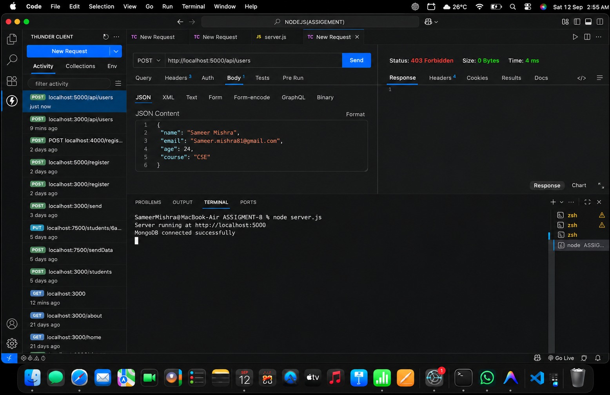
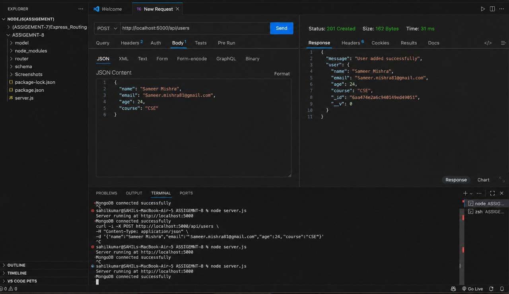
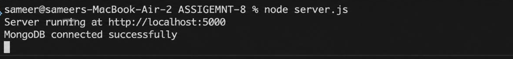
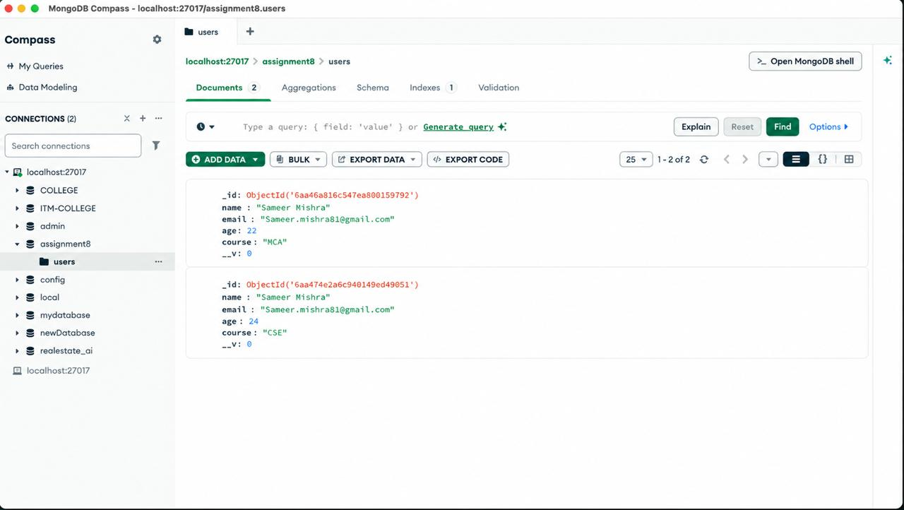

# Express MongoDB User API

## Express.js, MongoDB and Mongoose Assignment

This repository contains an Express.js application built using **Express.js**, **MongoDB**, and **Mongoose**.

The application allows users to:
- Connect an Express.js application to MongoDB using Mongoose
- Create and store user data in MongoDB
- Retrieve all users from MongoDB
- Use a separate schema, model, and router structure
- Test APIs using Thunder Client

---

## Project Structure

```text
ASSIGNMENT-8/

│
├── server.js
│
├── schema/
│   └── userSchema.js
│
├── model/
│   └── userModel.js
│
├── router/
│   └── userRouter.js
│
├── Screenshots/
│   ├── 1.png
│   ├── 2.png
│   ├── 3.png
│   └── 4.png
│
├── package.json
└── package-lock.json
```

## Screenshots

### Screenshot 1



### Screenshot 2



### Screenshot 3



### Screenshot 4


